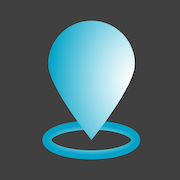
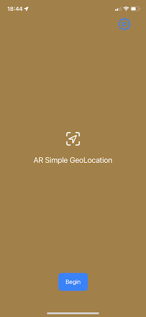
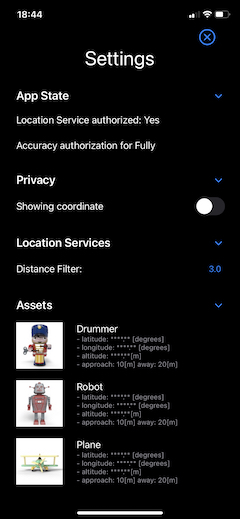
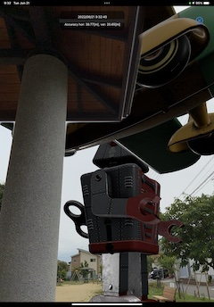
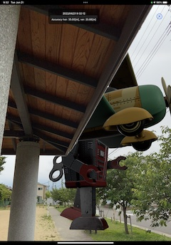
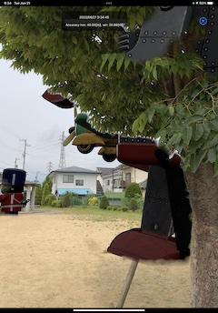
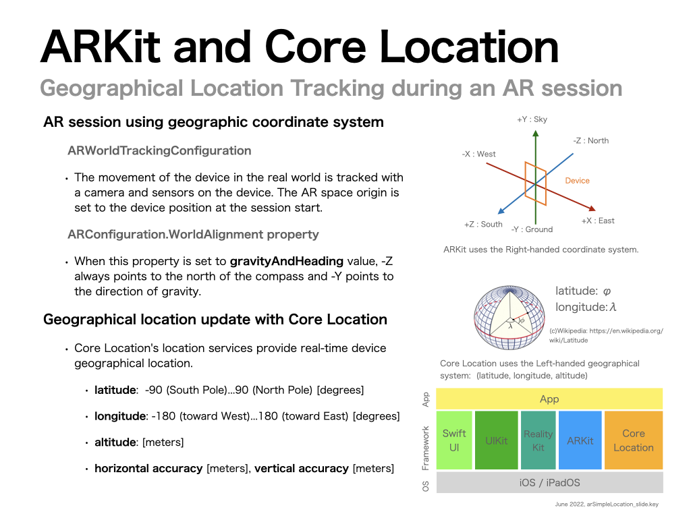

# AR Simple GeoLocation



A minimal iOS AR, Augmented Reality, app that displays virtual objects 
at specific geographical location, in an AR scene.

With the app you can

- specify virtual object's geographical locations with latitude, longitude, and altitude
- show virtual objects in an AR scene when you are nearby
- hide them when you leave them

The project;

- Xcode 14.0 beta 1 (The project file requires Xcode 14.0 or later.)
- Target: iOS / iPadOS 15.0 and later (You can easily change to iOS 14 support.)
- Frameworks: SwiftUI, ARKit, RealityKit, Core Location
- Before running the app, modify `ModelDataSet.swift` file to specify geographical locations near you

```swift:ModelDataSet.swift
ModelAsset(
    id: UUID(),
    name: "Drummer",
    thumbnailFile: "drummer128",  // optional
    assetFile: "toy_drummer",     // USDZ or reality file name (without ext)
    scale: SIMD3<Float>(1, 1, 1), // scale to display the virtual object
    orientationOnYAxis: 0,        // orientation on Y axis [radian]
    approachingDistance: 10.0,    // [m] distance to start showing the object
    distanceAway: 20.0,           // [m] distance to hide the object
    latitude: 35.68157,   // Tokyo station <-- change location [deg] +/-90
    longitude: 139.76561, //               <-- change location [deg] +/-180
    altitude: 3.5),       //               <-- change location [m]
       :
```

It shows;

- how to use Core Location to update user device's geographical locations
- how to link virtual space and geographical space
- how to coordinate real space tracking with camera and sensors, and geographic tracking with location services.

The app provides minimal UI and limited features, to clarify the basic code and logic.
Please modify the project to make your own apps.

You can

- download virtual object data from the server, depending on the user's' location
- show navigation to virtual objects near the user

I hope you find this project helpful. :)





You can enable the Object Occlusion in the Settings screen if you use iPhone or iPad, with LiDAR.





Geographical Location Tracking during an AR session



Type structure


## Models

This project uses Apple's USDZ model files. You can download other models.

- Apple [AR Quick](https://developer.apple.com/augmented-reality/quick-look/)

## References

- Apple Documentation: Core Location [Adding Location Services to Your App](https://developer.apple.com/documentation/corelocation/adding_location_services_to_your_app)


